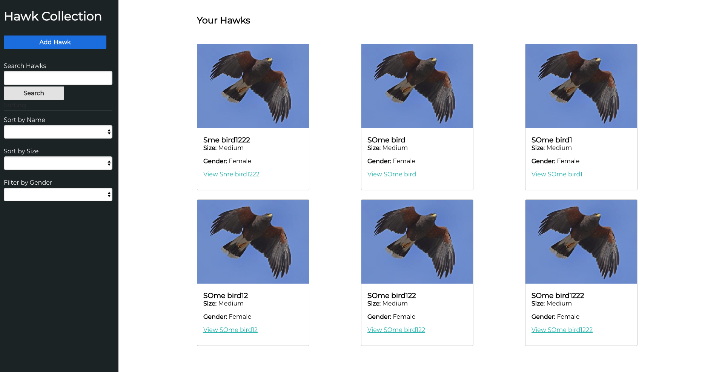
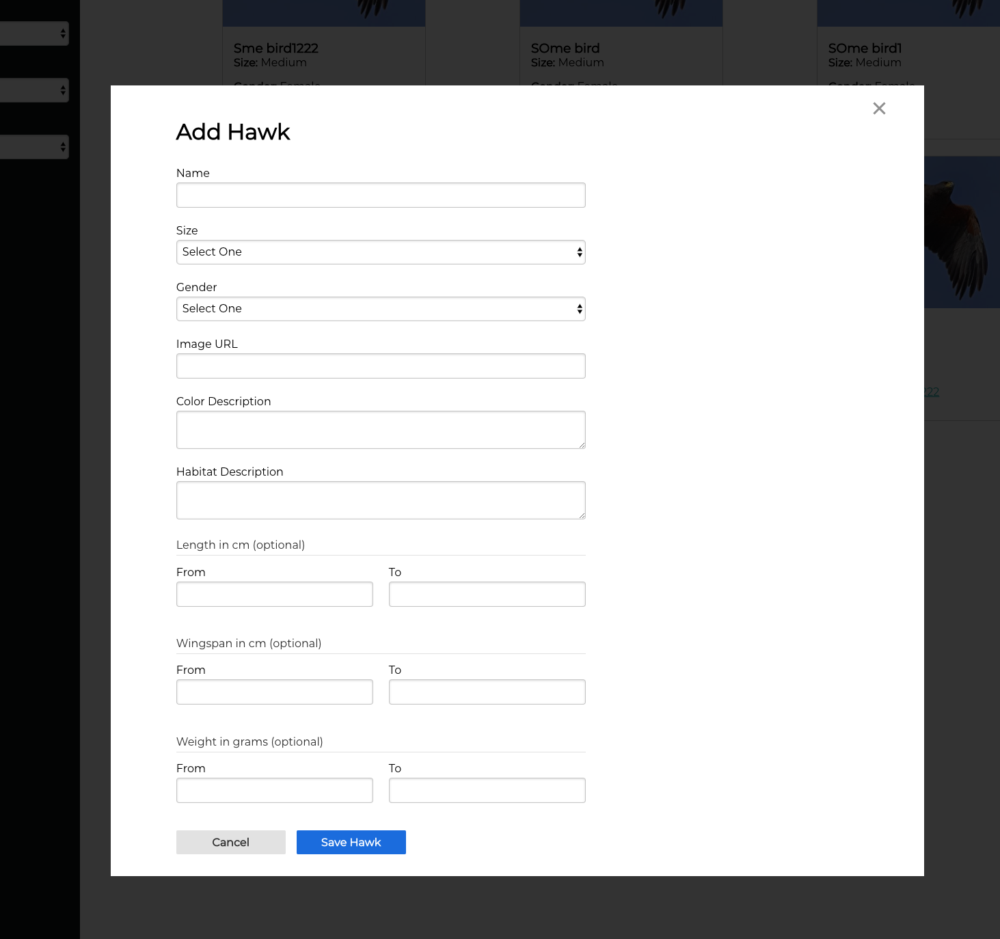

# Hawk Reference App

This project contains an api for managing a hawk species reference database.
The goal of this project is for you to implement the UI screens to manage the hawk reference database.

The UI design is a single page app with two screens. Please
reference the [screen mockups](Hawk%20Reference%20UI%20Mocks.pdf) for the design.

**NOTE:** _The github pdf render is not very good, please download the PDF for proper viewing._

The `ui/` folder contains a stub of the Typescript/React/Redux based UI.

You should fork this project and implement the UI based on the design.
The UI mocks are purposefully low fidelity and should be interpreted for actual component
and view design.

Be creative and demonstrate your UI skills!

## Dependencies

To build and run the api you'll need a have [docker](https://www.docker.com/products/docker-desktop).

## Build API Docker

```
$ docker-compose build
```

## Run API Server

```
$ docker-compose up -d
```

This will run the hawk api on `localhost:8000` and a `postgres` docker for the DB.

Logs from the API server can be viewed by running `docker logs hawkapi -f`.

## Stop API Server

```
docker-compose down
```

## Run UI Proxy

```
npm run proxy
```

## Run UI

```
npm start
```

## UI Screenshots



